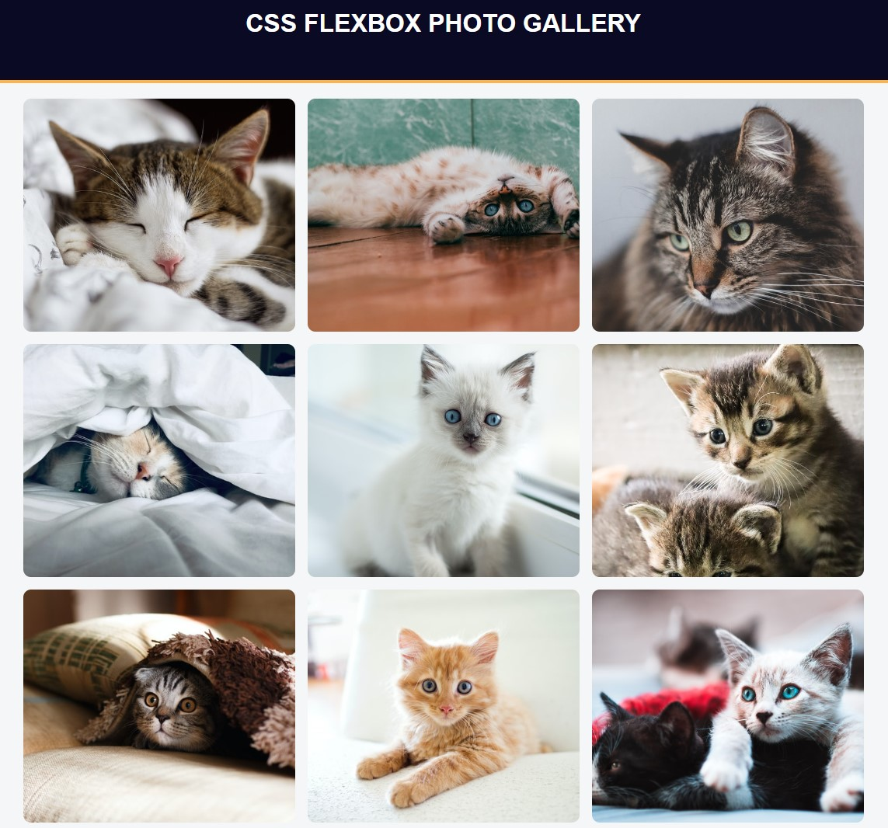

# PHOTO GALLERY

## 1. Description
freeCodeCamp project. This is a basic photo gallery template webpage.

[DIRECT LINK](https://cbushehry.github.io/cat-photo-app/)

## 2. Features
 * Nine cat photos in a 3x3 grid

 

## 3. Credits / Contact
This application was created by Cameron Bushehry

  
  